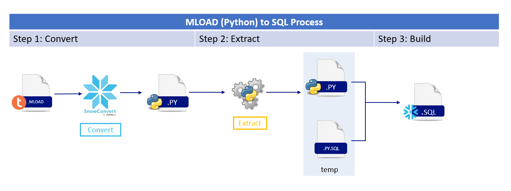
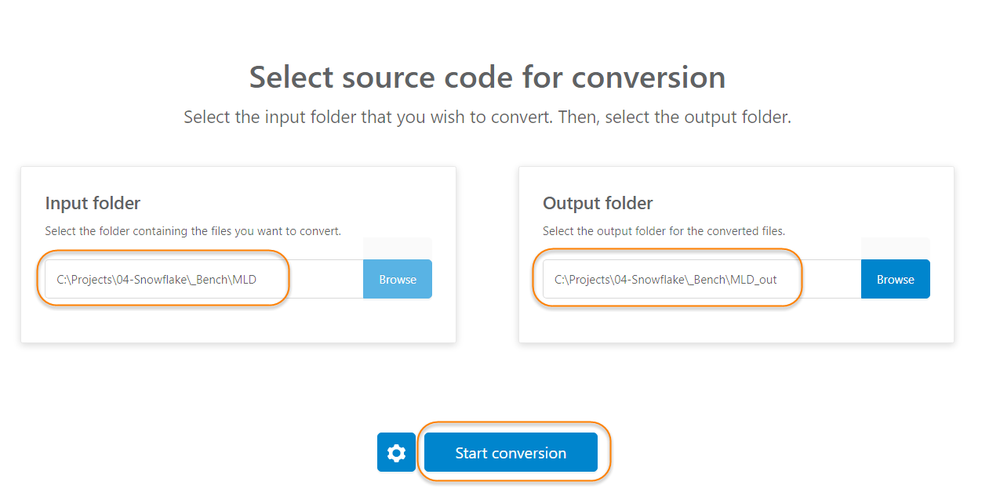
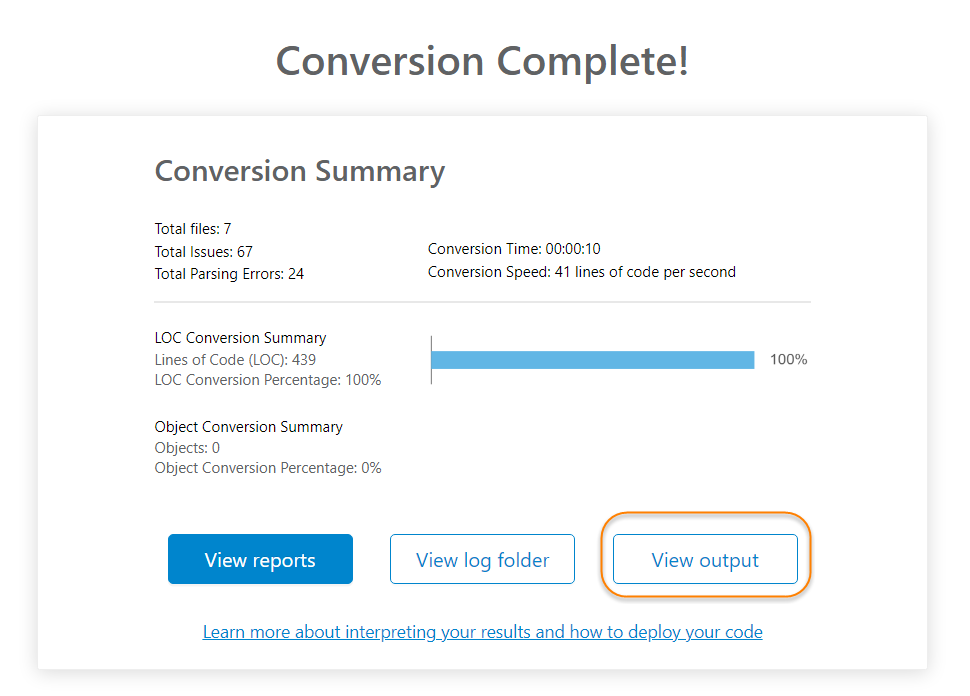
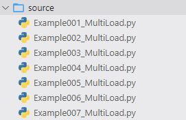
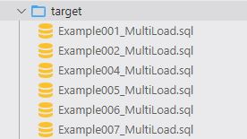

# Helpers for MLOAD to SQL

<!-- ------------------------ -->
## Introduction 
Teradata MLOAD (Python) to SQL Tool is a Python script that help you to convert the migrated MLOAD (using SnowConvert for Teradata) files to a SQL files. This tool was build specifically to convert from Phyton to SQL and not from Teradata to SQL. The script extracts the SQL statements found in the python (MLOAD) scripts and creates a new SQL file containing the logic needed to execute the file load and the logic migrated from the MLOAD.

### **Disclaimers** 

 - This lab is provided as reference guide in order to help accelerate the migration of MLOAD files to SQL which is not yet a supported feature in SnowConvert.

 - The lab assumes that you have a valid SnowConvert license.

 - The script provided in this lab is designed to work only on specific set of MLOAD patterns provided in the examples.

  - The script is provided as an accelerator to aid on the migration of MLOAD to SQL. It is not a MLOAD migration tool. Some manual adjustments might be needed after running the scripts.



In the following sections you will find the necessary steps to perform the MLOAD (python) file conversion.

### **Step 1: Convert MLOAD files using SnowConvert**

Before run this script, convert the Teradata MLOAD files using SnowConvert for Teradata Tool. The MLOAD files will be converted in Python and will be use as a source files in this process.

 

 


 ### **Step 2: Run the script**

 Put the converted MLOAD files in the source folder:

 You can find some Python examples [here](samples)

 

 Run the [mload_to_sql.py](./scripts/mload_to_sql.py) python script as follows:

 Parameters:
    
  - **inputdir:** This is the directory where your *.py files are
  - **outdir:** This is the directory where the SQL files will be put

```
  python mload_to_sql.py --inputdir .\source --outdir .\target
```


After run the script, you will find the following folders and SQL files:

 


