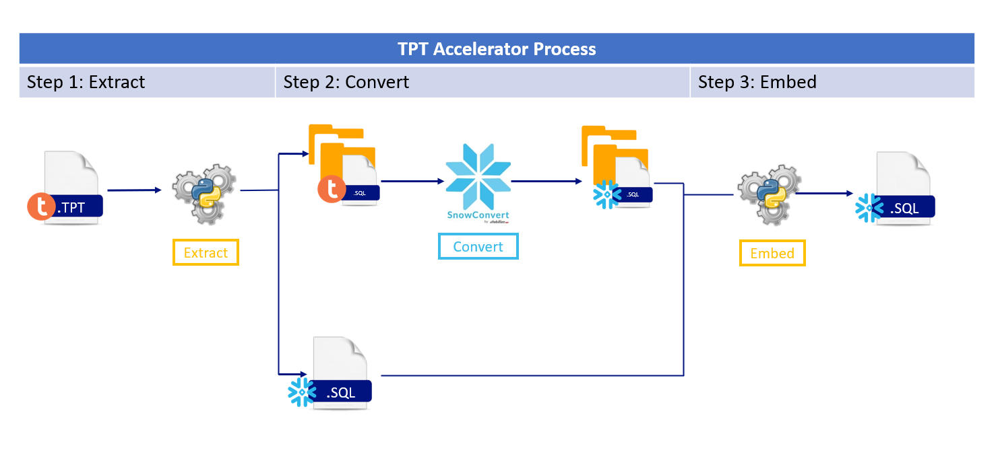
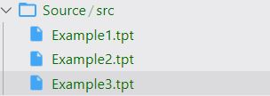
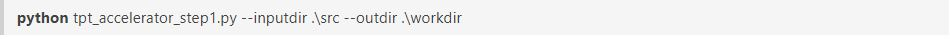
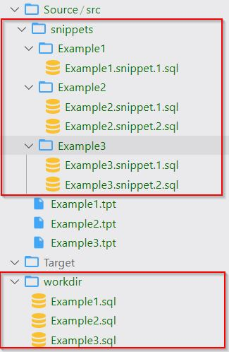
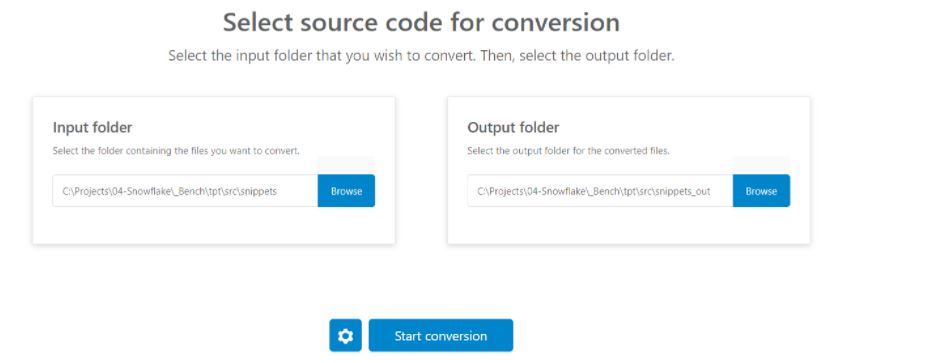
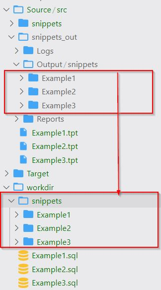
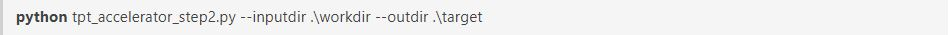
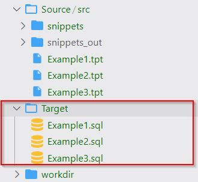

# Helpers for TPT to SQL

<!-- ------------------------ -->
## Introduction 
TPT Accelerator Scripts is a tool to help with the conversion from TPT to SnowSQL. There are two scripts, the first one extracts the SQL statements from the TPT file and generates a folder with all the SQL fragments ready to be converted to Snowflake using the SnowConvert tool. This script also generates a preliminary .SQL file with the declarations required to fulfill the TPT logic. The second script takes the converted code and the preliminary SQL file and embeds the converted code to generate the final SQL file.

### **Disclaimers** 

 - This lab is provided as reference guide in order to help accelerate the migration of TPT files to SQL which is not yet a supported feature in SnowConvert.

 - The lab assumes that you have a valid SnowConvert license.

 - The script provided in this lab is designed to work only on specific set of TPT patterns as described in the lab documentation.

  - The script is provided as an accelerator to aid on the migration of TPT to SQL. It is not a TPT migration tool. Some manual adjustments might be needed after running the scripts.

In the following sections you will find the necessary steps to perform the TPT file conversion.

### **Step 1 - Extract SQL Snippets**

Put TPT files in a source folder

 

Run the [tpt_accelerator_step1.py](/workspace/TeradataExportScripts/TPT_To_SQL/scripts/tpt_accelerator_step1.py) python script as follows:
 
Parameters:

 - **inputdir**: This is the directory where your *.tpt files are
 - **outdir**: This is the directory where the preprocessed SQL files will be put

 

After run the script, you will find the following folders and SQL files:

 - **snippets**: Root folder with all extracted SQL snippets
     - tpt folder: For each TPT file, you will find one folder with the SQL snippets
 - **outdir (workdir)**:  Output folder with the preprocessed SQL files.

 

### **Step 2: Convert SQL Snippets**

Convert the files located in src\snippets using SnowConvert for Teradata Tool. 

 

Copy the converted code in the outdir (workdir) folder as follows:

### Step 3: Embed the converted code

Run the [tpt_accelerator_step2.py](/workspace/TeradataExportScripts/TPT_To_SQL/scripts/tpt_accelerator_step2.py) python script as follows:

Parameters:
 
 - **inputdir**: This is the directory where your preprocessed SQL files and snippets are
 - **outdir**: This is the directory where the final SQL files will be put

After run the script, you will find the SQL files into output (target) folder.

### **Step 4: Stabilize the code**

To complete the conversion of the TPT files, it will be necessary to make manual changes to stabilize the code. Please note the warnings noted within each file.

| Warning | Sugested Solution |
|---|---|
| FILE FORMAT | File format definition must be changed according to the input file. More info https://docs.snowflake.com/en/sql-reference/sql/create-file-format.html |
| UPSERT | INSERT FOR MISSING UPDATE ROWS was found in TPT source file. It is posible some statements bellow must be converted to a single MERGE statement. More info: https://docs.snowflake.com/en/sql-reference/sql/merge.html|

